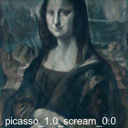
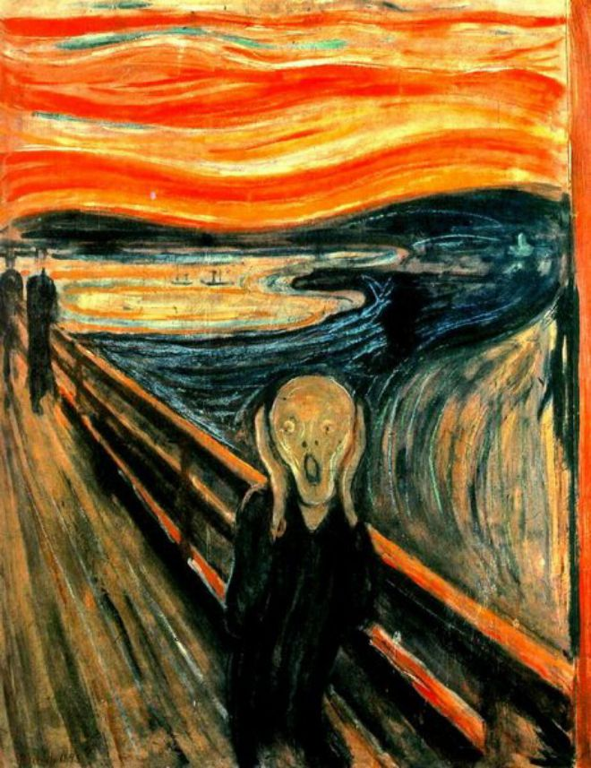

# Style Transfer
In this project, it was developed a method to transfer style from two different images onto a content image. 
Method allows for different weights to be assigned to each style image. 
Additionally, it was written an interactive widget tool to help with file selection, parameter tuning, and result visualization.

## Installation
To use our Style Transfer project, you first need to install the necessary dependencies. The required packages and versions can be found in the environment.yml file. You can create a new conda environment and install the dependencies using the following commands:

```bash
conda env create -f environment.yml
conda activate <environment_name>
```
After activating the environment, navigate to the lib folder and run run_style_transfer.py to use the tool.

```bash
usage: run_style_transfer.py [-h] [--content_image CONTENT_IMAGE]
                             [--style_image1 STYLE_IMAGE1]
                             [--style_image2 STYLE_IMAGE2]
                             [--num_steps NUM_STEPS]
                             [--style_weight STYLE_WEIGHT]
                             [--content_weight CONTENT_WEIGHT] [--print PRINT]

Neural Style Transfer Parser

optional arguments:
  -h, --help            show this help message and exit
  --content_image CONTENT_IMAGE
                        number of optimization steps
  --style_image1 STYLE_IMAGE1
                        weight of style loss
  --style_image2 STYLE_IMAGE2
                        weight of content loss
  --num_steps NUM_STEPS
                        number of optimization steps
  --style_weight STYLE_WEIGHT
                        weight of style loss
  --content_weight CONTENT_WEIGHT
                        weight of content loss
  --print PRINT         printing of losses during training
```
To utilize the interactive widgets, please open the Demo.ipynb notebook within your installed conda environment and run all cells. 
Once you have run the script, ten images with their results will be generated in the results folder. 
Additionally, a plot of the loss values and a GIF file containing the results pictures will be created.
## Examples
There were included several examples of style transfer.
Specifically, examples of transferring styles from Pablo Picasso's Seated Nude and Edvard Munch's The Scream onto Leonardo da Vinci's Mona Lisa.``html
<table>
  <tr>
    <td align="center">
        <b>Seated Nude by Pablo Picasso</b>
        <br>
    </td>
    <td align="center">
        <b>Style Transfered. Content weight 1</b>
        <br>
    </td>
    <td align="center">
        <b>The Scream by Edvard Munch</b>
        <br>
    </td>
  </tr>
</table>

The GIF with demonstration of interactive widget could be found by the [link]('demofiles/style_transfer.gif')
